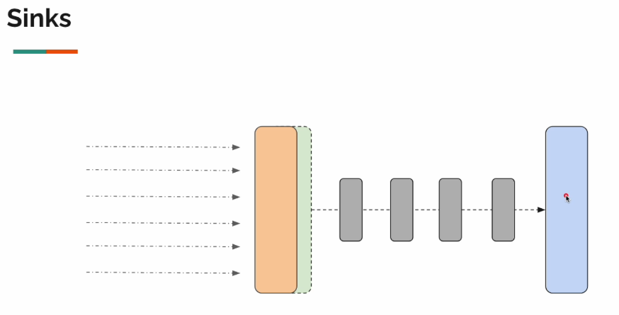
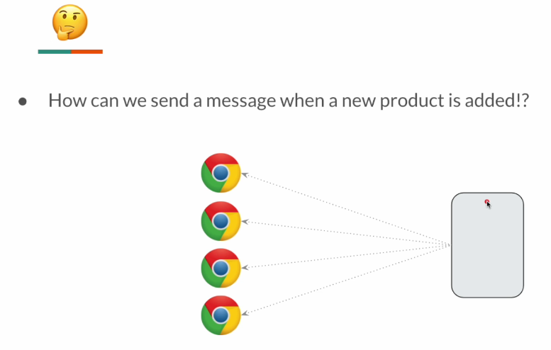

Let's assume the users are interested in new products, so they expect the backend server to notify them whenever a new product is added
so that the user might be interested in buying the new product.

Implement this business requirement using Server Sent Events.

Tricky Part: How do we know whenever a new product is added ? This is where we can use of concept called "Sink"

Sink will act like both the Publisher & the Subscriber. Multiple threads can emit data via one end & the other end will be 
acting like a Flux through which the subscribers can observe the items.

