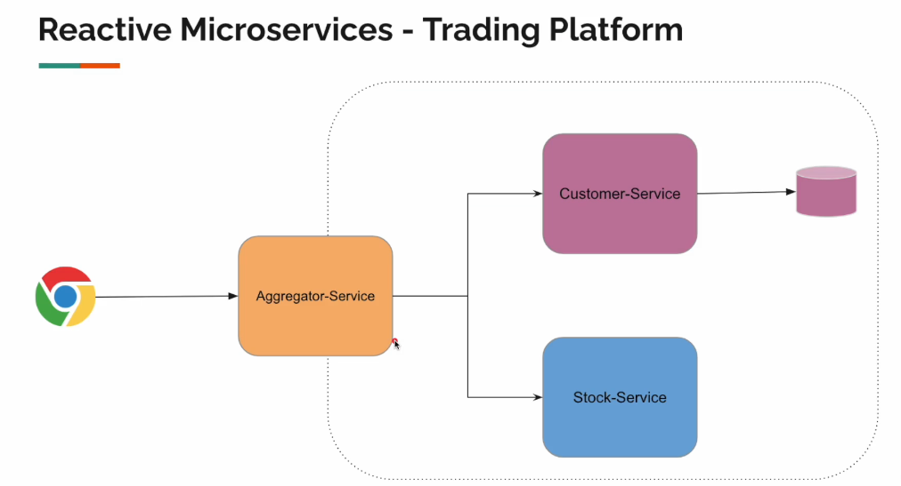
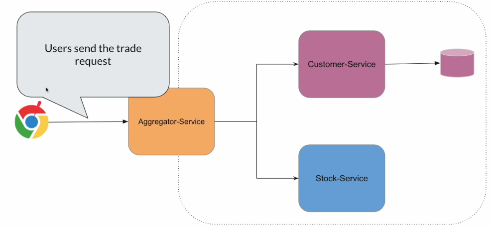
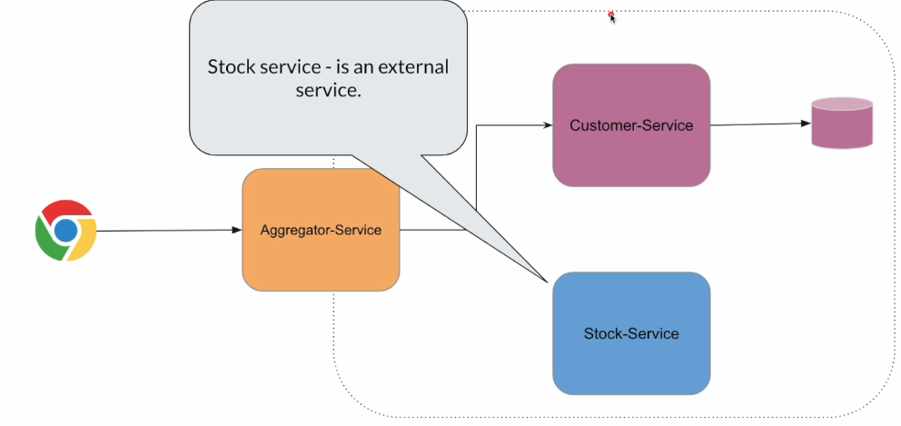
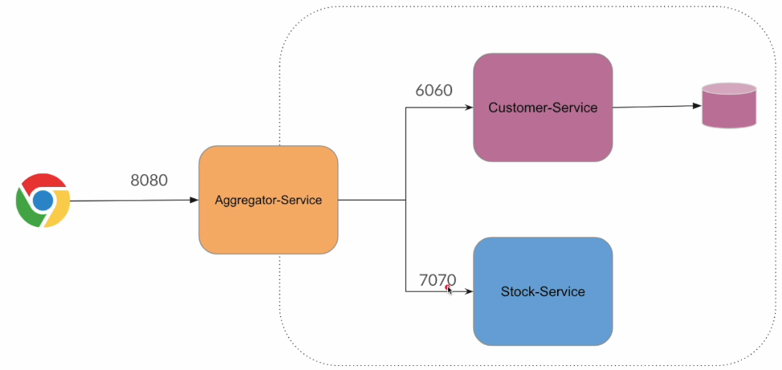

## Project Name: Trading Platform

### Description:

#### Aggregator Service: 
- `It's also called Orchestrator Service or BFF (Backend For Frontend)`
- `This is for customer facing API`

#### 

## Architecture:

## Flow:

## Low Level Details

